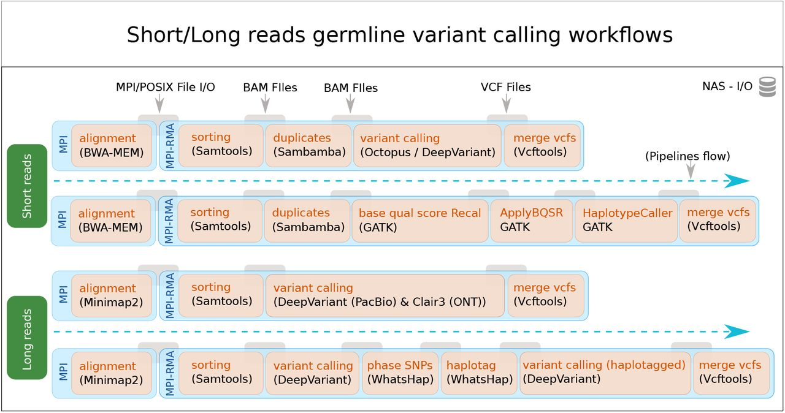

## GenMPI
### MPI-based Cluster Scalable Variant Calling forShort/Long Reads Sequencing Data

GenMPI, an MPI based scalable method for both widely used short and long reads aligners, BWA-MEM and Minimap2, respectively. One of the main goals of GenMPI is to ensure 100% identical variant output compared to the single node baseline. In addition, GenMPI provides a flexible architecture which can be used to integrate a variety of alignment and variant calling tools. 

#### overall architecture:

